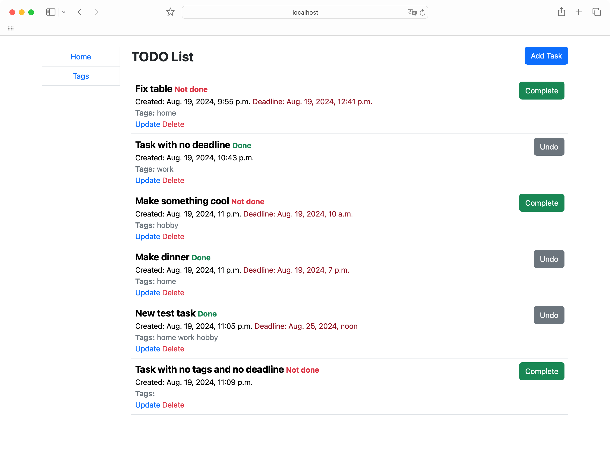
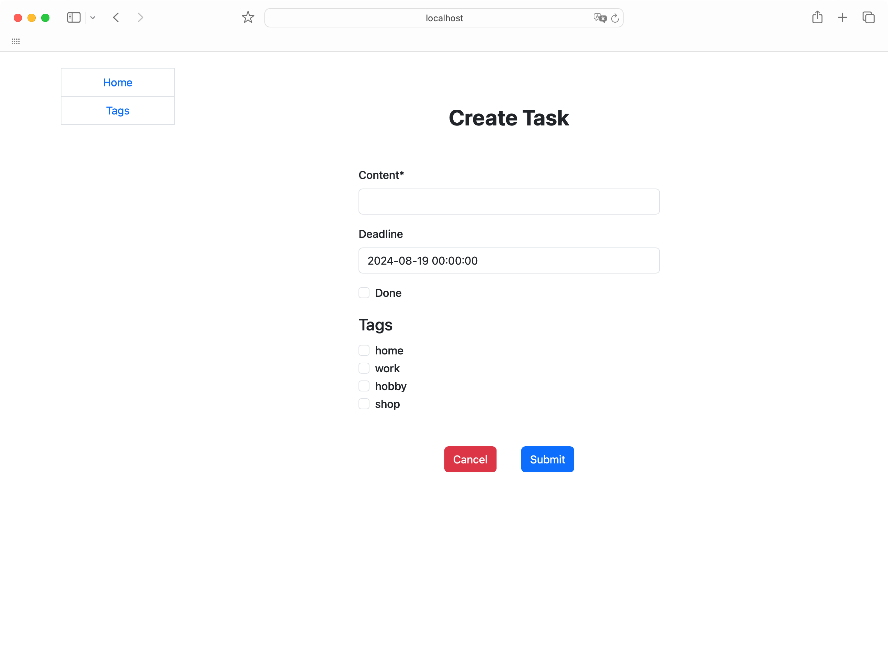
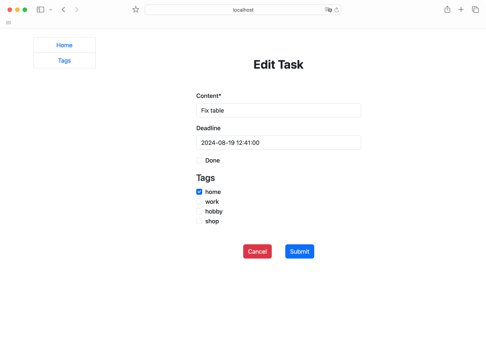
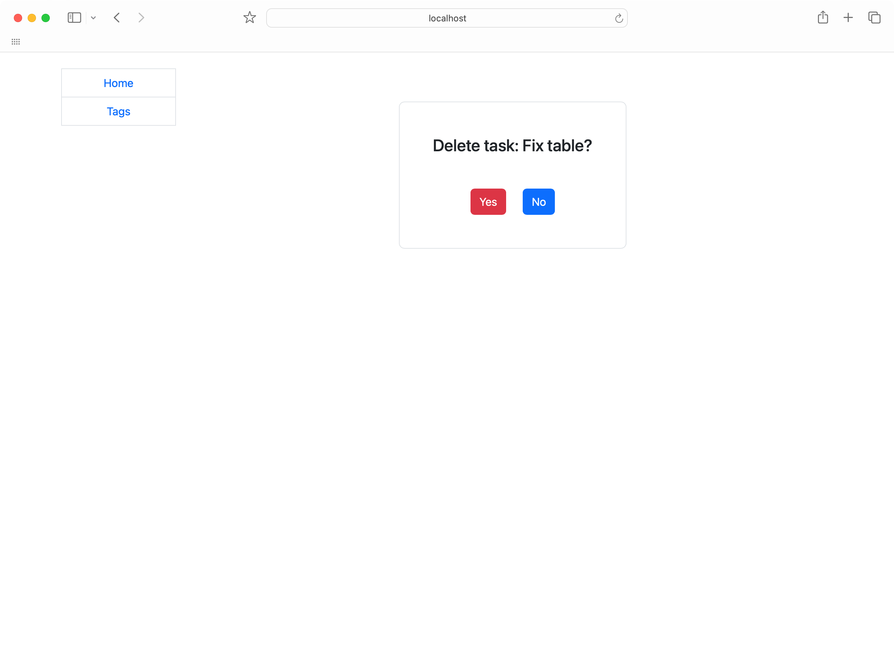
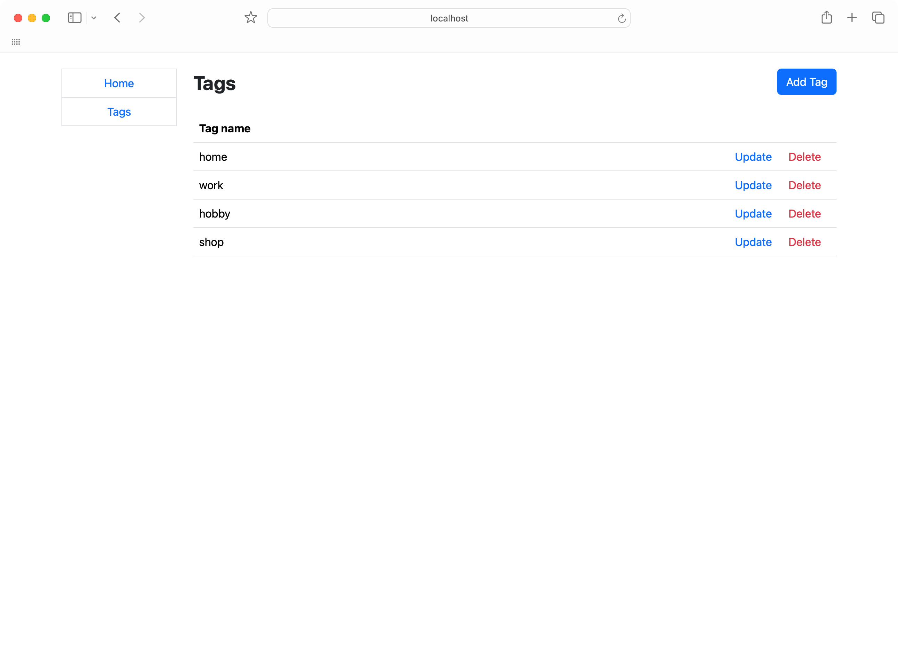
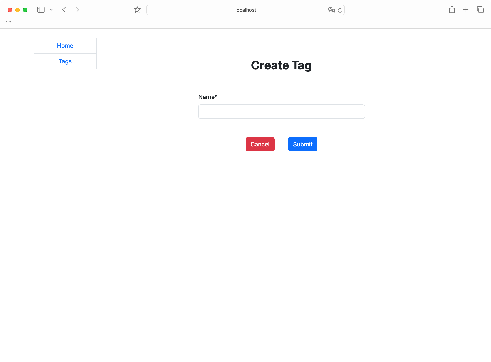
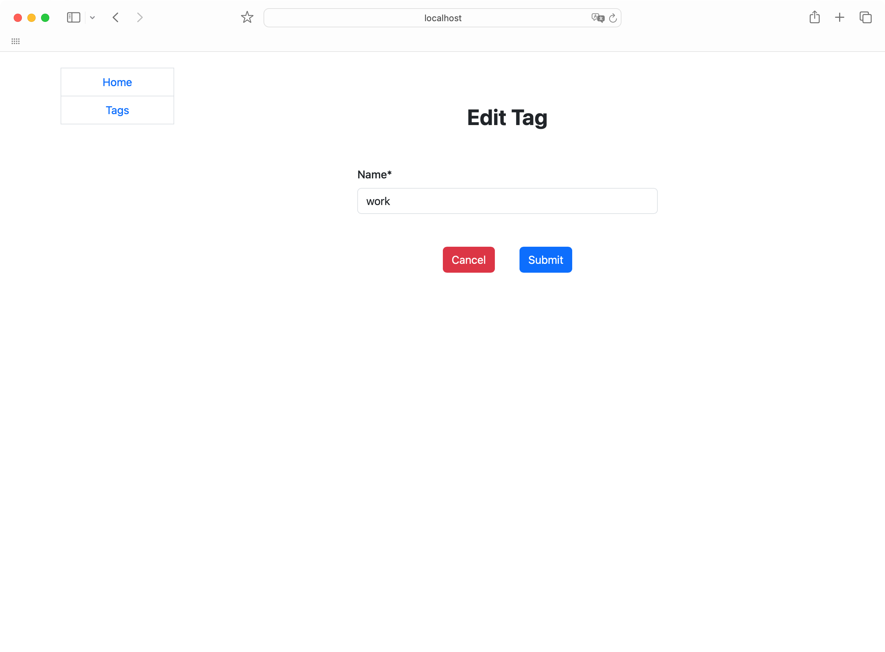
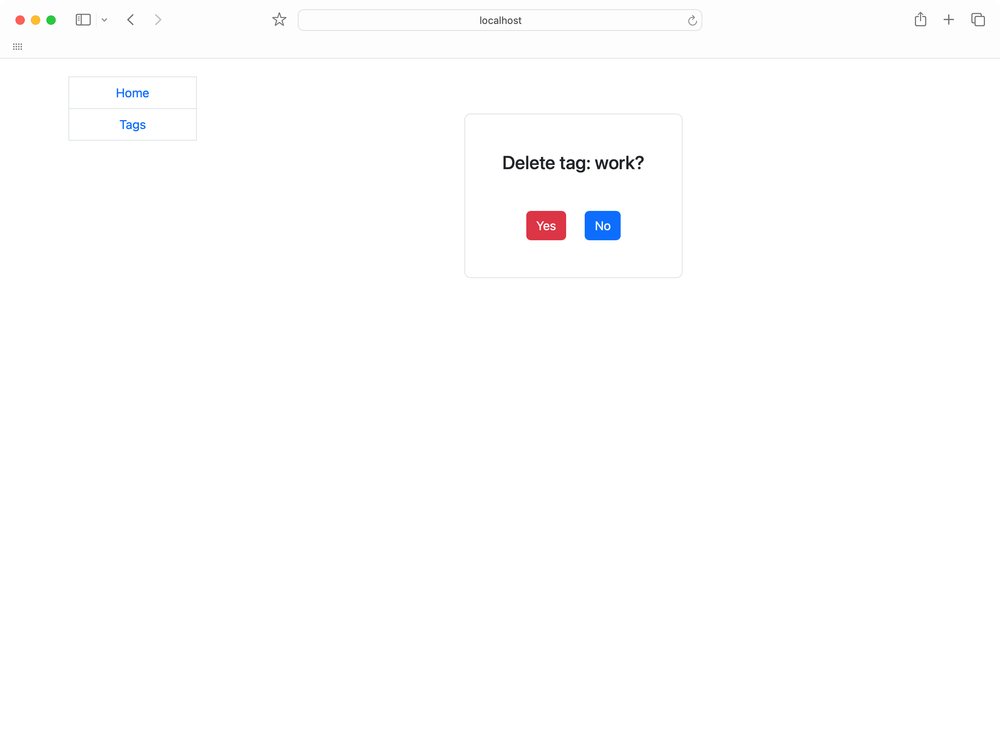

# Todo List

## This project is an assignment from Mate Academy to develop a simple Todo List app using Django.

### Tasks list page

### Create task page

### Edit task page

### Delete task page

### Tags list page

### Create tag page

### Edit tag page

### Delete tag page

